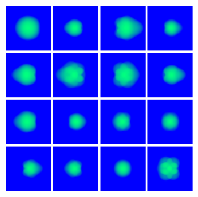
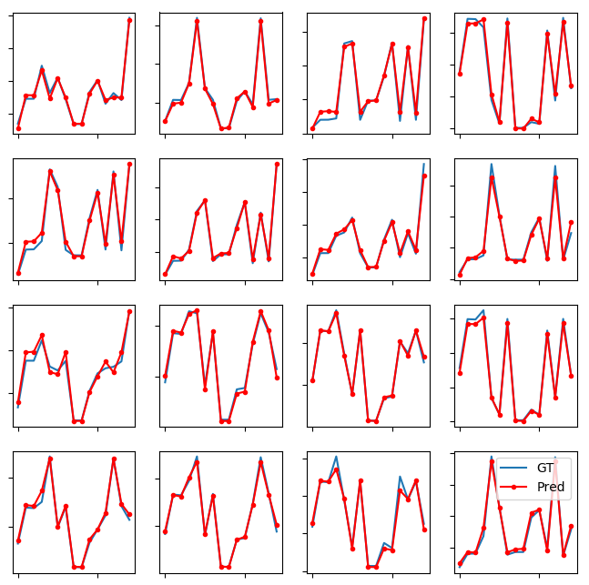

## Surrogate Models for Inertial Confinement Fussion

Scripts in this directory are surrogate deep learning models bridging simulation and experimental datasets from inertial confinement fusion (high energy physics) application. Please see [link](https://github.com/rushilanirudh/macc) for more details on model architectures and dataset description. Also, see LBANN documentations on how to install, build and run LBANN code. 

### Pre-train Wasserstein autoencoder (WAE)
```bash
python3 pre_train_jag_wae.py
```
### Train surrogate model using pre-trained WAE
```bash
python3 train_macc_surrogate.py
```
Expected output of pre-training WAE in LBANN (90K training, 10K validation dataset, on a single LLNL Pascal GPU) is shown:
```
--------------------------------------------------------------------------------

[0] Epoch : stats formated [tr/v/te] iter/epoch = [719/80/79]

            global MB = [ 128/ 128/ 128] global last MB = [  33  / 103  /  16  ]

             local MB = [ 128/ 128/ 128]  local last MB = [  33+0/ 103+0/  16+0]

--------------------------------------------------------------------------------

model0 (instance 0) training epoch 0 objective function : 940.059

model0 (instance 0) training epoch 0 recon_error : 0.0572849

model0 (instance 0) training epoch 0 run time : 5.74964s

model0 (instance 0) validation objective function : 34.3421

model0 (instance 0) validation recon_error : 0.00208194

model0 (instance 0) validation run time : 0.494716s

--------------------------------------------------------------------------------

[1] Epoch : stats formated [tr/v/te] iter/epoch = [719/80/79]

            global MB = [ 128/ 128/ 128] global last MB = [  33  / 103  /  16  ]

             local MB = [ 128/ 128/ 128]  local last MB = [  33+0/ 103+0/  16+0]

--------------------------------------------------------------------------------

model0 (instance 0) training epoch 1 objective function : 22.2183

model0 (instance 0) training epoch 1 recon_error : 0.00134448

model0 (instance 0) training epoch 1 run time : 5.53825s

model0 (instance 0) validation objective function : 11.6158

model0 (instance 0) validation recon_error : 0.000693222

model0 (instance 0) validation run time : 0.317699s

--------------------------------------------------------------------------------

[2] Epoch : stats formated [tr/v/te] iter/epoch = [719/80/79]

            global MB = [ 128/ 128/ 128] global last MB = [  33  / 103  /  16  ]

             local MB = [ 128/ 128/ 128]  local last MB = [  33+0/ 103+0/  16+0]

--------------------------------------------------------------------------------

model0 (instance 0) training epoch 2 objective function : 9.18846

model0 (instance 0) training epoch 2 recon_error : 0.000554316

model0 (instance 0) training epoch 2 run time : 5.69306s

model0 (instance 0) validation objective function : 6.96061

model0 (instance 0) validation recon_error : 0.00039013

model0 (instance 0) validation run time : 0.315543s

```

### Visual Outputs 
##### Ground Truth Images
 


##### Predicted Images


##### Ground Truth and Predicted Scalars


