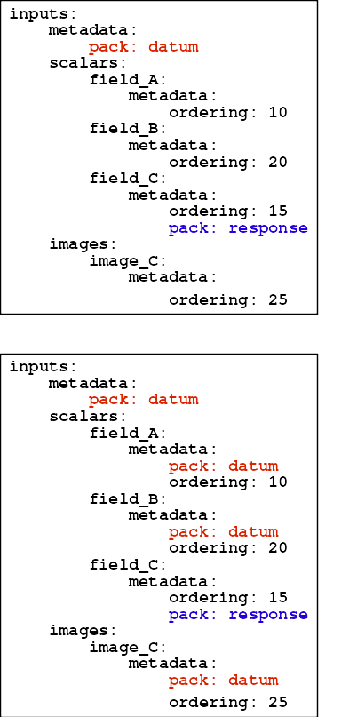

.. _sec:hdf5_data_reader:

================
HDF5 Data Reader
================

The HDF5 data reader is a flexible data reader that is designed to
ingest data samples from HDF5 format and place them into Conduit nodes
within LBANN. Rather than having to rewrite the data reader for any
given sample format, the HDF5 data reader uses a pair of *Schema*
files to allow the users to specify both the structure of a sample for
a given data set, as well as which fields of the sample to use for any
given experiment.

.. _sec:hdf5_schema:

-----------------------
HDF5 Schema files
-----------------------

This section describes the two *Schemas* that users must supply to run
LBANN with HDF5 data. A *Schema* is a YAML description of the HDF5
data hierarchy along with additional transformational information
(e.g., normalization values).

The *data_schema.yaml* file contains a description of the HDF5 data
hierarchy as it exists on disk.  The *experiment_schema.yaml* file
contains a specification of a subset of the data that is to be used in
an experiment.  We refer to these as the the data fields.
(*data_schema.yaml* and *experiment_schema.yaml* are stand-ins for the
user's filenames of choice.)

.. note::

   It follows from above that the *data_schema.yaml* need only
   describe that portion of the data set that is of interest to a
   common set of experiments. But, there is no penalty for supplying a
   schema with excess information.

An example *data_schema.yaml* follows.

.. code-block:: yaml

 inputs:
    initial_modes:
    trans_u:
    trans_v:
        metadata:
            scale: 1.666669
            bias: 0.5000008
            ordering: 104
 outputs:
    scalars:
        BWx:
        BT:
        tMAXt:
        MT:
            B4:
            after:
    images:
        metadata:
            dims: [64, 64]
            channels: 4
            scale: [29.258502, 858.26596, 100048.72, 4807207.0]
        img_1:
        img_2:
        img_3:

The ``metadata`` nodes are not part of the HDF5 hierarchy, but are
optionally added by the user.  For brevity, we only show two metadata
nodes. Metadata nodes:

* are optional,
* contain transformational information supplied by the user (i.e., are
  not part of the HDF5 hierarchy), and
* are inherited from their parents.

Regarding inheritance, every regular node (i.e., node from the HDF5
hierarchy) internally contains a metadata node as a child. Where not
explicitly stated in the schema, empty nodes are created. If a node
does not provide a ``metadata`` node, it inherits its parent's
metadata. However, if both contain the same field name, the child's
value prevails. We'll call this the "trickle-down rule". Hence, in the
above example, the metadata fields ``dims``, ``channels``, and
``scale`` will be applied to all three images. Specifically, ``image``
is ``img_1``'s parent. Since ``img_1`` does not have its own
``metadata`` node, it will inherit the ``metadata`` node belonging to
``image``.

Prior to discussing metadata further, here is an example
*experiment_schema.yaml*.

.. code-block:: yaml

 inputs:
     metadata:
        pack: datum
 outputs:
     metadata:
        pack: datum
     scalars:
         MT:
     images:

As stated above, this schema specifies the data fields to be used in
an experiment. The data fields are determined by the following
algorithm.  A tree traversal is conducted on the
*experiment_schema.yaml*. If a leaf in the *experiment_schema.yaml* is
an internal node in the *data_schema.yaml*, then the traversal is
"continued" at that point in the *data_schema.yaml* (of course,
bringing metadata nodes along).

In the above example, the following data fields are available per the
*experiment_schema.yaml*:

1. inputs: initial_modes, trans_u, trans_v
2. outputs/scalars: MT/B4, MT/after
3. outputs/images: img1, img2, img3

A point to note is that, because the user specified
outputs/scalars/MT, we only "continue the traversal" for the MT child
of the outputs/scalars node; i.e., we do not traverse the BWx, BT, or
tMAXt child nodes.

A primary design consideration of the two-schema plan was to enable
users to easily alter the selection, ordering, and transformations of
input data. In this regard, the *data_schema.yaml* will most likely be
static, as its metadata contains directives that are unlikely to
change from experiment to experiment (e.g., normalization values). The
*experiment_schema.yaml* can be thought of as a more minimalist
approach to specifying data fields and metadata. That said, users have
considerable latitude as to how and where they specify metadata; just
bear in mind the trickle-down rule.  :numref:`transference`
illustrates how metadata trickles down the sample's hierarchy.

     Example of metadata trickle-down in *schema* files. Upper
     diagram: example yaml file. Neither the *scalars* nor *images*
     fields contain metadata entries. Additionally, none of the leaf
     nodes contain pack fields. Lower diagram: the functional yaml
     file, after it is massaged during LBANN execution. Note that the
     *pack* entry for *field\_C* is not overridden.

-------------------
Metadata Directives
-------------------

By *Metadata Directive*, or more simply *directive*, we refer to the
keys in the metadata nodes, which we group as follows.

#. Packing. The *pack* directive requests the concatenation of
   multiple data fields. The resulting (composite) field can be
   retrieved by a call that contains the directive's value, which must
   be one of datum, label, response.  The *ordering* directives(below)
   determine the order in which concatenation occurs. All data fields
   in a packing group must be of the same primitive data type. If not,
   ensure that they are *coerced* (below).

#. Ordering. The *ordering* directive is a numeric field that
   determines how data is packed. This directive lets the user
   determine "the order in which things are stuffed into the tensor".
   The directive's values need be neither consecutive nor
   unique.

   .. note::

      Advice: this optional field is perhaps best placed in the
      *data_schema.yaml*, with desired overrides in the
      *experiment_schema.yaml*. Use widely spaced numbers in the
      *data_schema.yaml* so it is easy to override (rearrange the
      data) in the *experiment_schema.yaml*.

#. Normalization. We recognize the two numeric directives: *scale*
   and *bias*, which have their usual meanings. The values should be
   scalars or, for images, etc, lists of scalars.

#. Coercing. The *coerce* directive transforms data from its original
   type (i.e., as stored on media) to some other type, which is stored
   in memory and available upon request.  By example, if there's a
   "foo" data field on disk, of type ``float64_array``, and the
   metadata contains "coerce: float32", then the data will be
   converted to a ``float32_array``. Note that a *coerce* directive's
   value refers to a primitive scalar type; all data fields are
   assumed to be scalars or 1D arrays of scalars. One effect of our
   example is a reduction in memory use, though coercing in the other
   direction would have increased memory. As mentioned above, coercion
   may be necessary in conjunction with *pack* directives.

#. Images. In addition to the *scale* and *bias* directives, images
   may contain *dims*, *channels*, and *hwc* directives. There are two
   fields, *layout* and *transpose*, that describe how the channels in a
   multi-channel image / volume are arranged. If the *layout*
   directive is specified, and if it is *hwc* or *dhwc*, and if the
   *transpose* field is set to either *chw* or *cdhw*, then the images
   will be converted from a channels-last encoding to a channels-first
   format. At present, the only transformational format we
   support is channels-last to channels-first ("hwc -> chw" or
   "dhwc -> cdhw").

--------------
Larger Example
--------------

We conclude this section with a more fleshed-out example of the schemas.

*data_schema.yaml*:

.. code-block:: yaml

 inputs:
   shape_model_initial_modes:(4,3):
     metadata:
       scale: 1.666672
       bias: 0.5
       ordering: 100
   betti_prl15_trans_u:
     metadata:
       scale: 1.000002
       bias: -1.603483e-07
       ordering: 101
   betti_prl15_trans_v:
     metadata:
       scale: 1.000001
       bias: -1.406672e-06
       ordering: 102
 outputs:
   scalars:
     BWx:
       metadata:
         scale: 7.610738
         bias: -0.4075375
         ordering: 201
     BT:
       metadata:
         scale: 1.459875
         bias: -3.427656
         ordering: 202
     tMAXt:
       metadata:
         scale: 1.490713
         bias: -3.495498
         ordering: 203
     BWn:
       metadata:
         scale: 43.75123
         bias: -1.593477
         ordering: 204
   images:
     metadata:
       dims: [64, 64]
       channels: 4
       scale: [29.258502, 858.26596, 100048.72, 4807207.0]
       bias: [0.0, 0.0, 0.0, 0.0]
       layout: "hwc"
       transpose: "chw"

     (0.0, 0.0):
       0.0:
         emi:
           metadata:
             ordering: 300
     (90.0, 0.0):
       0.0:
         emi:
           metadata:
             ordering: 301

*experiment_schema.yaml*:

.. code-block:: yaml

 inputs:
   metadata:
     pack: "datum"

 outputs:
   metadata:
     pack: "datum"

   scalars:
     BWx:
       metadata:
         ordering: 555
     BT:
       metadata:
         ordering: 554

   images:
     metadata:
       coerce: "double"
     (90.0, 0.0):
       0.0:
