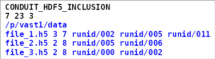
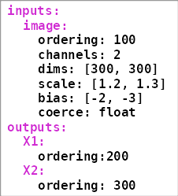

===========================================================
Generating Sample lists and Schema Files for HDF5 data sets
===========================================================

As noted in :ref:`HDF5 Data reader<sec:hdf5_data_reader>` the ``HDF5``
reader requires two (or three) input files. These input files are
derived from your HDF5 data file(s). We provide code that should aid
you in constructing the following derived input files.

-  The **sample list** contains the HDF5 filenames, along with a listing
   of the samples that are to be used from each file.
   See Section :ref:`Sample Lists<sec:sample-lists>` for details.

.. code-block:: bash

   CONDUIT_HDF5_INCLUSION
   7 23 3
   /p/vast1/data
   file_1.h5 3 7 runid/002 runid/005 runid/011
   file_2.h5 2 8 runid/005 runid/006
   file_3.h5 2 8 runid/000 runid/002

     Example of a small sample list

-  The **yaml** file(s) contain *schemas* that are descriptions of your
   hdf5 data hierarchy, along with additional metadata that describes such
   things as transformations (e.g, normalization); which data fields
   should be used as inputs, labels, or responses; etc.

   While the reader only requires a single **yaml** file,
   as discussed in :ref:`Using multiple yaml files <sec:yaml-multiple>`,
   it may be useful to break this file in two.

     Example *yaml* file

Sample IDs and samples: the hdf5 file
=====================================

With regard to the data hierarchy, we make a distinction between
*samples* and *sample IDs*; see Figures `[fig:1]`_ and `[fig:2]`_. Each
sample contains identical data fields, while each sample ID is unique.
It is important to understand this distinction because (1) our script
requires you to specify a sample ID as input, and (2) you were likely
not thinking in these terms when producing your hdf5 file [2]_.

Running the script
==================

The *generate_yaml* script (which generates both yaml and sample list
files) takes as input (1) an hdf5 filename, and (2) a sample ID. For the
example from Figure `[fig:1]`_ a command line could be:

.. math:: \textrm{generate\_yaml example-1.h5 RUN\_ID/000000003}

The choice of sample ID is arbitrary, i.e, you could use either
*RUN_ID/000000003* or RUN_ID/000000042. The script generates the
following files:

-  inclusion.sample_list

-  exclusion.sample_list

-  template.yaml

Editing the yaml file
---------------------

The metadata entries in the yaml file require editing prior to use [1]_.
As mentioned above, the metadata entries (which are not part of the
actual hdf5 data hierarchy) serve three purposes. First, they identify
which data fields are to use in an experiment. Second, they specify
transformations (i.e, normalization). Third, they specify the order in
which the data is packed into tensors. As generated, metadata entries
(except for the ordering fields) are commented out. You need to
uncomment these and add values as appropriate.

The *pack* fields can take one of the following labels: datum (fields
that are used to train your model); label; response. Uncommenting and
adding the appropriate labels is the minimum required modification. If
there are data fields that you do not wish to use, leave their *pack*
fields commented out. Alternatively, you can erase such fields from the
file.

When lbann is executed, metadata entries are propagated from internal to
leaf nodes. However, existing values are not overridden. Figure
`[fig:transference]`_ illustrates this concept. This feature enables you
to specify that multiple fields should be used for training your model
by modifying a single *pack* field.

Data type coercion
------------------

If your data type is not the same as lbann's default (which, as of this
writing, is *float*), then you should add **coerce: float** to the
appropriate metadata fields. This will ensure that you data is properly
cast to the desired type.

.. _sec:yaml-multiple:

Using multiple yaml files
-------------------------

TODO

.. _sec:sample-lists:

..
   Sample Lists
   ============

   Figure `[fig:sample-list]`_ contains a sample list example. Sample lists
   are formatted as follows.The first line is either CONDUIT_HDF5_INCLUSION
   or CONDUIT_HDF5_EXCLUSION. The second line contains: total number of
   samples to use (included samples); total number of samples NOT used
   (excluded samples); number of hdf5 files. The third line contains the
   base directory, that is, the directory in which your hdf5 files are
   located. This directory may contain subdirectories.

   The remaining lines contain: an hdf5 pathname (hence a file's complete
   pathname is the third line concatentated with this pathname); number of
   samples to use (included samples); number of samples to exclude.
   Remaining entries on the line a listing of the sample IDs to either
   include or exclude, depending on whether the first line contains
   CONDUIT_HDF5_INCLUSION or CONDUIT_HDF5_EXCLUSION.

   If you are using all or a majority of the samples, it's best to use the
   EXCLUSION version. The generated sample lists assume you are using all
   samples in all files. Hence, the inclusion version contains all sample
   IDs from all hdf5 file. If you are using all samples from your hdf5 file
   you can use either generated list as is; else, you will need to edit to
   indicate which samples to include or exclude.

Relationships between hdf5, yaml, and sample list files
=======================================================

Figure `[fig:relationships]`_ illustrates the relationships between a
user's hdf5 files and the generated yaml and sample list files.

.. figure:: example-1.png
     :align: center

     Example *yaml* file

.. figure:: example-1.png
     :align: center

     Screen shot from executing \textbf{hdfview example\_1.hdf5}. Seven sample IDs are shown (RUN\_ID/000000000, RUN\_ID/000000001, etc.), along with an expansion of the first two samples.

.. figure:: example-2.png
     :align: center

     Screen shot from executing \textbf{hdfview example\_2.hdf5}, with a partial expansion of the 5th sample.

.. figure:: transference.png
     :align: center

     Metadata transference. Upper diagram: example yaml file. Neither the \textit{scalars} nor \textit{images} fields contain metadata entries. Additionally, none of the leaf nodes contain pack fields. Lower diagram: the functional yaml file, after it is massaged during lbann execution. Note that the \textit{pack} entry for \textit{field\_C} is not overridden.

.. figure:: relationships.png
     :align: center

     This figure illustrates the relationships between a user's hdf5 files and the generated yaml and sample list files. The numbers on the second line of the sample list file are the total number of included samples, excluded samples, and hdf5 files. Assume each hdf5 file contains 10 samples. The metadata entries are not shown, because they are value-added, i.e, not part of the hdf5 data hierarchy.

.. _`[fig:relationships]`: #fig:relationships
.. _`[fig:transference]`: #fig:transference
.. _`[fig:sample-list]`: #fig:sample-list

.. _`[fig:sample-list]`: #fig:sample-list
.. _`[fig:yaml]`: #fig:yaml
.. _`[fig:1]`: #fig:1
.. _`[fig:2]`: #fig:2

.. |beginfigref| raw:: latex

                     \begin{minipage}{\textwidth}

.. |endfigref| raw:: latex

                   \end{minipage}
