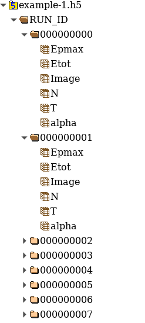
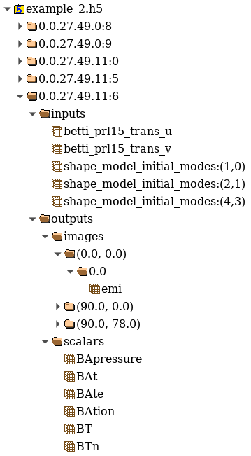

===========================================================
Generating Sample lists and Schema Files for HDF5 data sets
===========================================================

As noted in :ref:`HDF5 Data reader<sec:hdf5_data_reader>`, the HDF5
data reader requires two (or three) input files. These input files are
derived from the HDF5 data file(s). LBANN provides a simple utility
code to aid in constructing the following derived input files.

- The **sample list** contains the HDF5 filenames, along with a
  listing of the samples that are to be used or excluded from each
  file.  See Section :ref:`Sample Lists<sec:sample-lists>` for
  details.

  .. code-block:: bash
      :caption: Example of a inclusive sample list with 7 valid samples
                from 3 files.  Note that 23 samples in the 3 files were
                excluded.
      :name: hdf5_inclusive_other

      CONDUIT_HDF5_INCLUSION
      7 23 3
      /p/vast1/data
      file_1.h5 3 7 runid/002 runid/005 runid/011
      file_2.h5 2 8 runid/005 runid/006
      file_3.h5 2 8 runid/000 runid/002

- The **schema YAML** file(s) contain :ref:`schemas<sec:hdf5_schema>`
  that are descriptions of the HDF5 data hierarchy, along with
  additional metadata that describes such things as transformations
  (e.g., normalization); which data fields should be used as inputs,
  labels, or responses; etc.

  .. code-block:: bash
      :caption: Example *schema* file in YAML format.
      :name: hdf5_schema

      inputs:
        image:
          ordering: 100
          channels: 2
          dims: [300, 300]
          scale: [1.2, 1.3]
          bias: [-2, -3]
          coerce: float
      outputs:
        X1:
          ordering: 200
        X2:
          ordering: 300

Sample IDs and samples: the hdf5 file
=====================================

With regard to the data hierarchy, there is a distinction between
*samples* and *sample IDs*; see :numref:`hdf5_hrrl_example_1` and
:numref:`hdf5_jag_example_2`. Each *sample* contains identical data
fields, while each *sample ID* is unique. This distinction is
important because the LBANN utility for generating sample lists and
schemas requires the sample ID of a prototypical sample in the data
set.

     **HRRL example** - Screen shot from executing **hdfview
     hrrl\_example\_1.hdf5**. Seven sample IDs are shown
     (*RUN\_ID/000000000*, *RUN\_ID/000000001*, etc.), along with an
     expansion of the first two samples.

     **JAG example** - Screen shot from executing **hdfview
     jag\_example\_2.hdf5**, with a partial expansion of the fifth sample.

Running the utility
=====================

The ``generate_schema_and_sample_list`` utility (which generates both
schema and sample list files) takes as input a file containing a list
of HDF5 filenames and a sample ID for a prototypical sample. The given
sample ID must be found in the first HDF5 file in the file
list. :numref:`generate_schema` shows a set of example command line
options.

.. code-block:: bash
   :caption: Example commands to generate schema and sample list from
             data sample
   :name: generate_schema

   generate_schema_and_sample_list filelist_PROBIES.txt RUN_ID/000000000
   generate_schema_and_sample_list filelist_carbon.txt e1/s100
   generate_schema_and_sample_list filelist_jag.txt 0.0.96.7.0:1

As each sample is expected to have the an identical representation,
the choice of sample ID is arbitrary. For example, *RUN_ID/000000002*
or *RUN_ID/000000003* could be used for *filelist_PROBIES.txt*. The
utility generates the following files:

-  inclusion.sample_list
-  exclusion.sample_list
-  data_schema.yaml

Editing the YAML file
---------------------

The metadata entries in the YAML file require editing prior to use
:numref:`transference`.  As mentioned in :ref:`HDF5
Schemas<sec:hdf5_schema>`, the metadata entries (which are not part of
the actual HDF5 data hierarchy) serve three purposes. First, they
identify which data fields are to use in an experiment. Second, they
specify transformations (i.e., normalization). Third, they specify the
order in which the data is packed into tensors. As generated, metadata
entries (except for the ordering fields) are commented out. They need
to be uncommented and values need to be manually specified as
appropriate.

The ``pack`` fields can take one of the following labels: "datum" (fields
that are used to train the model), "label", and "response". Uncommenting and
adding the appropriate labels is the minimum required modification. If
there are data fields that are not to be used, their *pack*
fields should remained commented out. Alternatively, such fields can
simply be deleted from the file.

When LBANN is executed, metadata entries are propagated from internal
to leaf nodes. However, existing values are not
overridden. :numref:`transference` illustrates this concept. This
feature allows the specification of multiple fields that should be
used for training a model by modifying a single ``pack`` field.

Data type coercion
------------------

If the data type of a particular field is not the same as LBANN's
default (which, as of this writing, defaults to ``float``), it may be
necessary to add **coerce: float** to the appropriate metadata
fields. This will ensure that the data is properly cast to the correct
type.

Relationships between HDF5, YAML, and sample list files
=======================================================

:numref:`relationships` illustrates the relationships between a
user's HDF5 files and the generated YAML and sample list files.

.. figure:: relationships.png
     :align: center
     :name: relationships

     This figure illustrates the relationships between a user's HDF5
     files and the generated schema YAML and sample list files. The
     numbers on the second line of the sample list file are the total
     number of included samples, excluded samples, and HDF5
     files. Assume each HDF5 file contains 10 samples. The metadata
     entries are not shown, because they are value-added, i.e., not
     part of the HDF5 data hierarchy.
