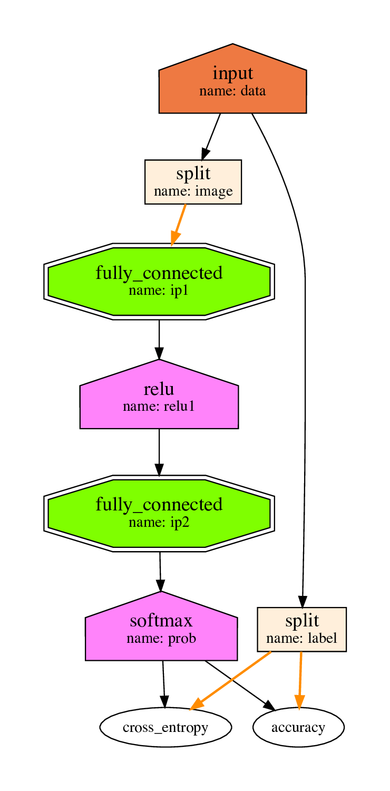

# `lbann.onnx`
This sub-package provides a way to convert [LBANN](https://github.com/LLNL/lbann) models from/to [ONNX](https://github.com/onnx/onnx) models.
* `LBANN_ROOT` environment variable may be used to explicitly specify a LBANN root directory.
   * Otherwise, `git rev-parse --show-toplevel` is used.

## How to Test
Run `./setup.py test` to verify generated Protobuf/ONNX files.
* You may need to run `scripts/download_onnx_model_zoo.sh` to get pre-trained ONNX models.
* Converted Protobuf/ONNX models will be generated if `LBANN_ONNX_DUMP_MODELS=1` is set.

## How to Use
See `examples/onnx/lbann2onnx.py` and `examples/onnx/onnx2lbann.py` for details.
* Set `LBANN_ONNX_VERBOSE=1` to show detailed conversion warnings.

## Support Status
See the following documentation for details.
* [Operators/Layers Support Status](support_status.md)
* [Details of the LBANN -> ONNX Conversion](l2o.md)
* [Details of the ONNX -> LBANN Conversion](o2l.md)

## Example: Converting [the MNIST model](/model_zoo/models/simple_mnist/model_mnist_simple_1.prototext) from LBANN to ONNX
See [`viz/l2o/`](viz/l2o/) for more details.

### LBANN (vizualized with [viz.py](/viz/viz.py))

### ONNX (vizualized with [Netron](https://github.com/lutzroeder/netron))

### ONNX with the original node names

